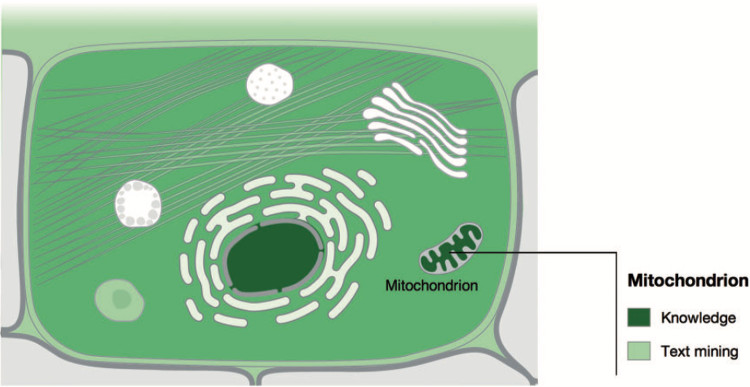

Whereas molecular networks can capture many aspects of protein functions, most current networks do not capture the important dimensions of space and time, which are important to understand diseases and the molecular level. We lead the development of several resources that aim to capture this in a way that integrates tightly with STRING and related network resources.

## Localization & expression

The spatial dimension is captured by two web-accessible databases, [COMPARTMENTS](https://compartments.jensenlab.org/) and [TISSUES](https://tissues.jensenlab.org/), which focus on protein localization at the subcellular and organismal level, respectively. Both resources are updated on a weekly basis and integrate evidence from manually curated literature, high-throughput screens, and automatic text mining. We map all evidence to common protein identifiers and ontology terms and further unify it by assigning confidence scores that facilitate comparison of the different types and sources of evidence. We finally visualize these scores on schematics of eukaryotic cells and mammals to provide a convenient overview. The resulting visualizations are shown in GeneCards, and the cell schematics have also been adopted by UniProt.

The temporal aspect is more difficult to capture in a systematic manner, since time is always with respect to a biological process and different processes take place on vastly different time scales. So far we have focused on understanding temporal regulation in the context of the eukaryotic cell division cycle which has been studied several organisms, employing a wide range of high-throughput technologies, such as microarray-based mRNA expression profiling and quantitative proteomics. We have created an online database, [Cyclebase](https://cyclebase.org/), which allows users to easily visualize and download results from genome-wide, cell cycle-related experiments.

## Disease associations

Identification of disease genes and prioritization of candidate drug targets or biomarkers are important application areas of bioinformatics in general and network analysis in particular. To facilitate such analyses, we have developed the [DISEASES](https://diseases.jensenlab.org/) database, which is updated on a weekly basis and integrates disease-gene associations from automatic text mining, manually curated literature, cancer mutation data, and genome-wide association studies (GWAS). We further unify the evidence by assigning confidence scores that facilitate comparison of the different types and sources of evidence. Combined with the [STRING](https://string-db.org/) and the Cytoscape [stringApp](http://apps.cytoscape.org/apps/stringapp), this allows for easy network analyses of diseases.

The reanalysis of GWAS is handled the [DistiLD](http://distild.jensenlab.org/) database. In this resource we link published GWAS studies to standardized disease codes, place the associated SNPs in the genomics context of gene annotations and linkage-disequilibrium blocks, and provide a web interface to explore and visualize them.

The continuous work on improving the DISEASES database is done as part of the NIH program [Illuminating the Druggable Genome](https://commonfund.nih.gov/idg), which aims to shed light on unstudied and understudied drug targets. Through this project we also contribute to web resources on drug targets maintained by our US collaborators, including [Pharos](https://pharos.nih.gov/) and [TIN-X](http://www.newdrugtargets.org/).
