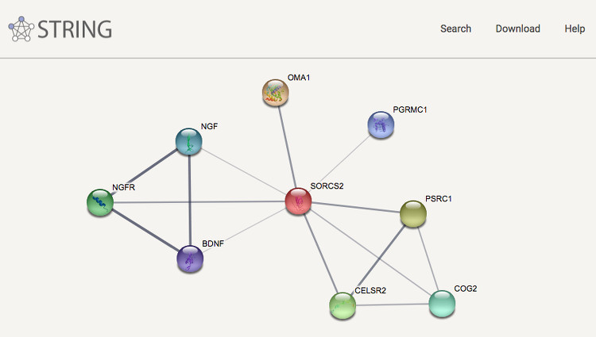
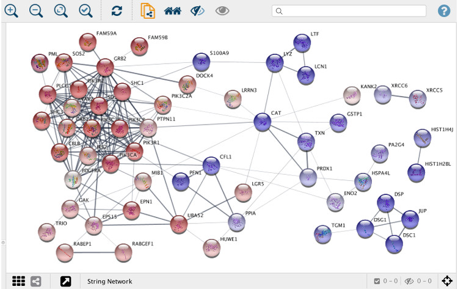

Given the name of the group, Cellular Network Biology, it should come as no surprise that much of our work centers around molecular interactions within and between cells. As part of this, we develop and maintain several databases on the topic.

## Interaction databases

Together with groups at the [European Molecular Biology Laboratory](https://www.embl.de/) and the [University of Zurich](https://www.uzh.ch/en.html) we have created the heavily used [STRING](https://string-db.org/) database, which covers both physical interactions and functional associations between proteins. Apart from collecting and reassessing available experimental data and importing known pathways and protein complexes from curated databases, interaction predictions are derived from co-expression analysis, detection of shared selective signals across genomes, automated text-mining of the scientific literature and computational transfer of interaction knowledge between organisms based on orthology. The underlying orthology relationships are available through the [eggNOG](http://eggnogdb.embl.de/) database, and the STRING network is expanded with chemical-protein interactions in the [STITCH](https://stitch-db.org/) database.

We have furthermore expanded the STRING network to cover also microRNAs and other non-coding RNAs in the [RAIN](https://rth.dk/resources/rain/) resource, which we develop in collaboration with the [Center for non-Coding RNA in Technology and Health](https://rth.dk/).

Most recently, we have created [STRING Viruses](http://viruses.string-db.org/), which is a sister resource to STRING that extends the scope from intra-species interactions of proteins from cellular organisms to include also viral proteins and their interactions with host proteins.

## Visualization tools

Whereas web interfaces are well suited for working with individual or small groups of proteins, more powerful tools are needed when working with large networks resulting from, for example, proteomics or other omics technologies. To this end, we collaborate with the [Cytoscape](http://cytoscape.org/) to develop [stringApp](http://apps.cytoscape.org/apps/stringapp), which imports protein-protein and protein-chemical interaction data from [STRING](https://string-db.org/) and [STITCH](http://stitch.embl.de/) into Cytoscape.

Users provide a list of one or more gene, protein or compound identifiers, the species, and a confidence score and stringApp will query the database and return the matching network. Currently, four different queries are supported:

* STRING: protein query -- enter a list of protein names (e.g. gene symbols or UniProt identifiers/accession numbers) to obtain a STRING network for the proteins
* STRING: PubMed query -- enter a PubMed query and utilize text mining to get a STRING network for the top N proteins associated with the query
* STRING: disease query -- enter a disease name to retrieve a STRING network of the top N proteins associated with the specified disease
* STITCH: protein/compound query -- enter a list of protein or compound names to obtain a network for them from STITCH

stringApp also allows users to expand the resulting network by adding an arbitrary number of nodes (protein or chemical compounds), change the confidence score, and expand the network by adding new nodes. In addition, stringApp v1.1 can retrieve functional enrichment for Gene Ontology terms, KEGG Pathways, and protein domains at a user-specified significance threshold and show the results in a new table in the Table Panel. All STRING networks are visualized using a new "String Style" custom graphic, which closely resembles the networks on the [STRING website](https://string-db.org/).

If you want to learn how to use this tool, we provide a full set of [stringApp exercises](/training/stringapp/).
